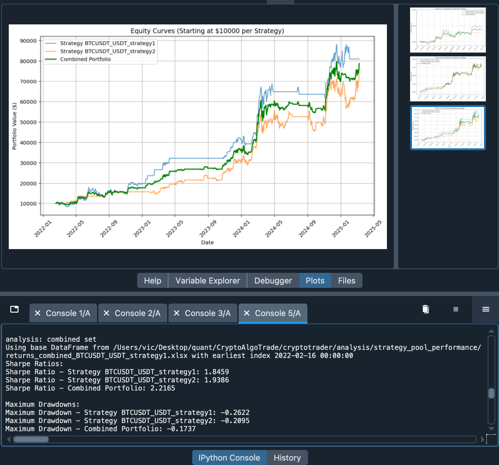

# strategy_pool_performance

## Overview
- Demo to combine two distinct strategies (corr < 0.5) into a single portfolio to enhance overall performance.
- The approach aims to maximize the Sharpe Ratio while minimizing Maximum Drawdown (MDD) through equally weighted allocation. 

- python code: [combined_strategy_analysis.py](https://github.com/victor-w-dev/strategy_pool_performance/blob/main/combined_strategy_analysis.py)

 
